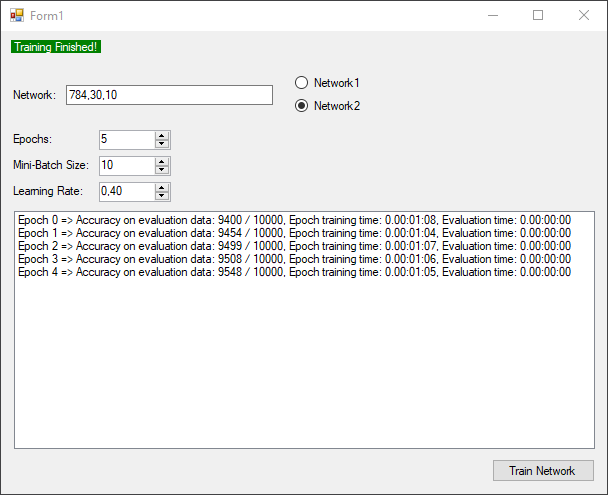

# Background
Freestyle .NET port of code from online book :

[Neural Networks and Deep Learning](http://neuralnetworksanddeeplearning.com)

As I was reading the book I decided to take the journey of implementing neural net in C# to test my understanding.

Code is very tightly related to the original code provided with the book, which is in Python.

Implementation uses *`WinForms`* and *`Math.NET Numerics`* package.

 